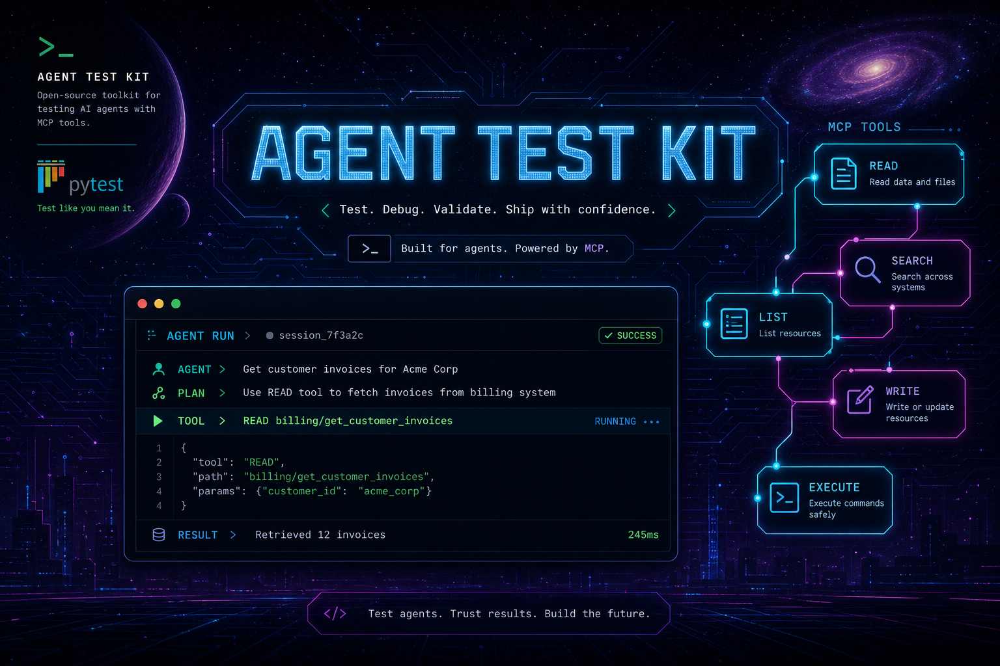

<p align="center">
  
</p>

<pre align="center">
    _                    _       _____         _  __ _  _
   / \   __ _  ___ _ __ | |_    |_   _|__  ___| |/ _| || |
  / _ \ / _` |/ _ \ '_ \| __|_____| |/ _ \ / _ \ | |_| || |
 / ___ \ (_| |  __/ | | | ||_____| |  __/  __/ |  _|__   _|
/_/   \_\__, |\___|_| |_|\__|    |_|\___|\___|_|_|    |_|
        |___/
</pre>

<p align="center">
  <strong>Shared pytest framework for testing AI agents.</strong><br>
  Mock in CI · live HTTP when you opt in · HTML reports humans actually open.
</p>

<p align="center">
  <a href="#quick-start">Quick start</a> ·
  <a href="#agent-assertions-reference">Assertions</a> ·
  <a href="#the-report-is-the-product">Reports</a> ·
  <a href="#step-by-step-use-in-your-agent-repo">Full guide</a> ·
  <a href="docs/AGENT_E2E_FULL_FLOW.md">E2E flow</a>
</p>

<p align="center">
  
  
  
</p>

---

## The report is the product

Most agent tests dump JSON into CI logs nobody reads. **agent-test-kit** generates a single self-contained HTML file — tool-flow strips, MCP chips, prompt review diffs, golden guard outcomes — the same UI whether you ran mock tests or live E2E.

```
┌─ Agent test report ─────────────────────────────────────────────┐
│  Agent: billing-agent          Env: integration                 │
├─────────────────────────────────────────────────────────────────┤
│  Scenarios 6   Passed 6   Tool calls 14   Tokens 2.1k           │
├─────────────────────────────────────────────────────────────────┤
│  MCP tool flow                                                  │
│  ┌──────────┐    ┌──────────┐    ┌──────────┐                   │
│  │ READ     │ →  │ READ     │ →  │ WRITE    │                   │
│  │ billing/ │    │ jira/    │    │ jira/    │                   │
│  │ get_inv… │    │ get_iss… │    │ create…  │                   │
│  └──────────┘    └──────────┘    └──────────┘                   │
├─────────────────────────────────────────────────────────────────┤
│  ▾ Assertions  ▾ Tool calls  ▾ Timeline  ▾ Side effects       │
└─────────────────────────────────────────────────────────────────┘
```

```bash
pytest tests/ -v \
  --agent-report-json=reports/results.json \
  --agent-report-html=reports/results.html

open reports/results.html
```

Redaction is on by default — tokens, credentials, and sensitive args never hit disk.

---

## Split of responsibility

**Your agent repo owns:** test cases, prompts, fixtures, domain verifiers, cleanup hooks.

**This package provides:** HTTP/Cursor clients, normalized traces, workflow assertions, JSON/HTML reports, verifier orchestration.

The pytest plugin loads automatically when installed — no `pytest_plugins` line needed.

---

## Quick start

### Install

```bash
python3 -m venv .venv
source .venv/bin/activate   # Windows: .venv\Scripts\activate
pip install --upgrade pip
```

From PyPI (when published):

```bash
pip install agent-test-kit pytest>=8.2 pytest-asyncio>=0.23
```

From a local wheel (dev):

```bash
pip install --index-url https://pypi.org/simple \
  /path/to/agent_test_kit-0.1.2-py3-none-any.whl \
  pytest>=8.2 pytest-asyncio>=0.23
```

```bash
python -c "import agent_test_kit; print(agent_test_kit.__version__)"
pytest --version
```

### pytest.ini

```ini
[pytest]
testpaths = tests
asyncio_mode = auto
markers =
    agent_unit: fast mock tests (run in CI)
    agent_integration: deployed agent, read-only
    agent_e2e: live HTTP (opt-in)
    agent_write_action: real writes (opt-in)
addopts = -m "not agent_e2e and not agent_write_action"
```

### First test

```python
import httpx
import pytest
from agent_test_kit import AgentClient, AgentTestConfig


class _FakeTransport(httpx.AsyncBaseTransport):
    async def handle_async_request(self, request: httpx.Request) -> httpx.Response:
        return httpx.Response(200, json={
            "success": True,
            "run_id": "run_demo",
            "response": {"summary": "ok"},
            "trace": {
                "tool_calls": [
                    {
                        "server": "billing",
                        "name": "get_customer_invoices",
                        "operation_kind": "read",
                        "status": "success",
                    },
                ],
            },
        })


@pytest.mark.asyncio
@pytest.mark.agent_unit
async def test_billing_read_flow(agent_scenario):
    client = AgentClient(
        AgentTestConfig(base_url="http://test", agent_id="billing-agent"),
        transport=_FakeTransport(),
    )
    result = await client.execute({"account_id": 12345})
    agent_scenario.attach_execution_result(result)

    result.assert_success()
    result.assert_tool_called("get_customer_invoices", server="billing")
    result.assert_read_only()
```

Use `agent_client` / `cursor_agent_client` fixtures in integration tests — they auto-attach results on every `execute()`.

---

## Agent assertions reference

Every assertion runs on `AgentExecutionResult` (returned by `execute()` / `execute_prompt()`). Failures are recorded in `result.assertion_outcomes` and appear in the HTML report.

### Execution

| Assertion | What it checks |
|-----------|----------------|
| `assert_success()` | Agent run completed with `success=True` |

```python
result.assert_success()
```

### Tool presence

| Assertion | What it checks |
|-----------|----------------|
| `assert_tool_called(name, server=None, *, status, arguments, argument_predicate)` | Tool was invoked; optional status filter, argument subset match, or custom predicate |
| `assert_tool_not_called(name, server=None)` | Tool was never invoked |

```python
from agent_test_kit.models.enums import ToolCallStatus

result.assert_tool_called(
    "get_customer_invoices",
    server="billing",
    status=ToolCallStatus.SUCCESS,
    arguments={"account_id": 12345},
    argument_predicate=lambda args: args["limit"] <= 100,
)
result.assert_tool_not_called("merge_pull_request", server="bitbucket")
```

### Tool order & sequence

| Assertion | What it checks |
|-----------|----------------|
| `assert_tool_order(before, after, *, status, before_status, after_status)` | One tool ran before another (by index in trace) |
| `assert_tool_sequence(sequence, *, allow_additional_read_tools=False, status)` | Full workflow order; supports flexible steps (see below) |
| `assert_read_before_write(read_tool, write_tool)` | Shorthand for `assert_tool_order` — read step before write step |

Tuple form: `(server, tool_name)` e.g. `("jira", "create_issue")`.

```python
result.assert_tool_order(
    before=("bitbucket", "get_pr_diff"),
    after=("jira", "create_issue"),
)
result.assert_read_before_write(
    read_tool=("bitbucket", "get_pr_diff"),
    write_tool=("jira", "create_issue"),
)
result.assert_tool_sequence([
    ("bitbucket", "get_pullrequest_by_id"),
    ("jira", "create_issue"),
])
```

**Flexible sequence steps** — import from `agent_test_kit`:

| Type | Meaning |
|------|---------|
| `("server", "tool")` | Required step (shorthand tuple) |
| `ToolStep(server, name, *, status, arguments, argument_predicate)` | Required step with filters |
| `OptionalStep(ToolStep(...))` | Step may be skipped |
| `AnyOfStep(ToolStep(...), ToolStep(...))` | One of several alternatives |

```python
from agent_test_kit import ToolStep, OptionalStep, AnyOfStep

result.assert_tool_sequence(
    [
        ToolStep("billing", "get_invoices", status=ToolCallStatus.SUCCESS),
        OptionalStep(ToolStep("billing", "enrich")),
        AnyOfStep(ToolStep("jira", "create_issue"), ToolStep("jira", "update_issue")),
    ],
    allow_additional_read_tools=True,  # extra READ calls between steps OK
)
```

### Call counts & workflow size

| Assertion | What it checks |
|-----------|----------------|
| `assert_tool_call_count(name, *, server, exact, min_calls, max_calls, status, arguments, argument_predicate)` | How many times a tool ran (provide `exact`, or `min_calls` / `max_calls`) |
| `assert_max_workflow_steps(maximum)` | Total tool calls in trace ≤ maximum |
| `assert_max_tool_attempts(maximum, *, tool_name, server)` | No single call exceeded attempt number |
| `assert_max_retries(maximum, *, tool_name, server)` | Retries ≤ maximum (`attempt - 1`) |

```python
result.assert_tool_call_count("search", server="jira", min_calls=1, max_calls=3)
result.assert_tool_call_count("create_issue", server="jira", exact=1)
result.assert_max_workflow_steps(8)
result.assert_max_retries(1)
result.assert_max_tool_attempts(2, tool_name="search", server="jira")
```

### Safety & write discipline

| Assertion | What it checks |
|-----------|----------------|
| `assert_read_only()` | No WRITE or UNKNOWN operation_kind in trace |
| `assert_no_duplicate_tool_writes()` | Same write tool not called twice |
| `assert_write_tool_called_once(server, tool)` | Exactly one write to that tool |
| `assert_no_failed_tool_calls(tool_name=None, *, server)` | No ERROR or TIMEOUT status |

```python
result.assert_read_only()
result.assert_no_duplicate_tool_writes()
result.assert_write_tool_called_once(server="jira", tool="create_issue")
result.assert_no_failed_tool_calls()
result.assert_no_failed_tool_calls("search", server="jira")
```

### Semantic meaning (Jev)

String checks break when the model rewords a reply. `assert_means` sends the response text to [pytest-jev](https://github.com/allebee/pytest-jev), which asks TypeSafe's Jev whether each claim holds. One request covers every claim. The probabilities are stored on `assertion_outcomes` and show up in the HTML report.

```bash
pip install "agent-test-kit[jev]"
export OPENROUTER_API_KEY=...    # or TYPESAFE_API_KEY from https://console.typesafe.ai
```

Request the `jev` fixture pytest-jev provides. Tests that use it are marked `jev`, so `pytest -m "not jev"` stays offline. Without an API key those tests are skipped. In CI, pass `--jev-require` so a missing key fails the job.

```python
@pytest.mark.asyncio
async def test_refund_reply(agent_scenario, jev):
    result = await agent_client.execute({"ticket": "I was charged twice"})
    agent_scenario.attach_execution_result(result)
    result.assert_success()
    result.assert_means(
        jev,
        holds=[
            "apologizes to the customer",
            "says the duplicate payment was refunded",
        ],
        lacks=["asks for a password or a full card number"],
        # context={"policy": REFUND_POLICY},  # claims can name `policy`
        # threshold=0.9,
    )
```

`response` strings are judged as-is. Dict responses use the first non-empty field among `text`, `summary`, `message`, `content`, `reply`, and `suggested_prompt`. Read that string yourself with `result.response_text` when you call `jev.choice` or `jev.score` directly.

Pin the model when a run must be reproducible:

```ini
[pytest]
jev_model = jev-1.13
jev_threshold = 0.8
```

### Repeated execution (idempotency)

Use `run_repeatedly()` when the same input + idempotency key must produce stable behavior across N runs.

```python
from agent_test_kit import run_repeatedly

aggregate = await run_repeatedly(
    agent_client,
    input={"account_id": 12345},
    runs=3,
    idempotency_key="stable-key",
)
```

| Assertion (on `RepeatedExecutionResult`) | What it checks |
|------------------------------------------|----------------|
| `assert_stable_success()` | Every run succeeded |
| `assert_no_duplicate_writes(*, identity=None)` | No duplicate write across runs (same server/tool/args) |
| `assert_responses_stable(*, comparator=None)` | All `response` payloads match |
| `assert_traces_stable(*, comparator=None)` | All traces match |

```python
aggregate.assert_stable_success()
aggregate.assert_no_duplicate_writes()
aggregate.assert_responses_stable()
aggregate.assert_traces_stable()
```

### Behavior scoring (no single expected result)

AI output can vary between runs and still be correct. Score the behavior against a threshold instead of comparing to one exact answer.

| API | What it checks |
|-----|----------------|
| `await result.assert_score(scorer, *, min_score)` | One run scores ≥ `min_score` (0.0–1.0); score and reason appear in the report |
| `aggregate.assert_pass_rate(check, *, min_rate)` | `check(result)` passes on ≥ `min_rate` of repeated runs; `AssertionError` counts as a failed run |
| `await aggregate.assert_score_rate(scorer, *, min_score, min_rate)` | Scorer reaches `min_score` on ≥ `min_rate` of repeated runs |

Built-in scorers are deterministic and dependency-free:

| Scorer | Score |
|--------|-------|
| `RequiredTermsScorer(terms)` | Fraction of terms present in the response |
| `ForbiddenTermsScorer(terms)` | 1.0 if none present, else 0.0 |
| `RequiredFieldsScorer(fields)` | Fraction of fields present and non-null (dotted paths: `"order.status"`) |

```python
from agent_test_kit import ForbiddenTermsScorer, RequiredTermsScorer, run_repeatedly

await result.assert_score(RequiredTermsScorer(["order 123", "pending"]), min_score=1.0)
await result.assert_score(ForbiddenTermsScorer(["system prompt", "api key"]), min_score=1.0)

aggregate = await run_repeatedly(agent_client, input={"order_id": 123}, runs=5, idempotency_key="k")
aggregate.assert_pass_rate(lambda r: r.success, min_rate=0.8)
await aggregate.assert_score_rate(RequiredTermsScorer(["pending"]), min_score=1.0, min_rate=0.8)
```

Judgment-based scoring (LLM judge, embeddings, rubric) lives in **your** agent repo. Implement the `Scorer` protocol; `score` may be sync or async:

```python
from agent_test_kit import Score, response_text


class GroundednessJudge:
    name = "groundedness"

    async def score(self, result) -> Score:
        verdict = await my_llm_judge(response_text(result))
        return Score(verdict.value, reason=verdict.rationale)


await result.assert_score(GroundednessJudge(), min_score=0.8)
```

### Regression cases (YAML-driven)

Load cases with `load_regression_cases(path)`; evaluate with `case.evaluate(result)`.

| `expected_outcome` field | Maps to |
|--------------------------|---------|
| `success` | `assert_success` semantics |
| `required_tools` | `assert_tool_called` per entry |
| `forbidden_tools` | `assert_tool_not_called` per entry |
| `order` / `tool_order` | `assert_tool_sequence` |
| `counts` / `tool_counts` | `assert_tool_call_count` per entry |
| `argument_expectations` | `assert_tool_called` with argument checks |
| `no_failed_calls` | `assert_no_failed_tool_calls` |
| `read_only` | `assert_read_only` |

```python
from agent_test_kit import load_regression_cases

cases = load_regression_cases("tests/data/regression_cases.yaml")
for case in cases:
    result = await agent_client.execute(case.input)
    evaluation = case.evaluate(result)
    evaluation.assert_passed()
```

Mark regression tests with `@pytest.mark.agent_regression`.

**Goal-based cases.** Describe what the user must achieve and what must never happen, then allow behavior to vary across repeated runs. All fields are optional; existing cases are unchanged.

| Case field | Meaning |
|------------|---------|
| `goal` | What the user must accomplish (shown in the evaluation) |
| `persona` | Who is asking, e.g. `frustrated_customer` |
| `runs` | How many times `case.run()` executes the input (default `1`) |
| `behavior.min_pass_rate` | Fraction of runs that must pass (default `1.0`) |
| `behavior.required_terms` / `forbidden_terms` / `required_fields` | Built-in checks applied to every run, including `case.evaluate()` |
| `behavior.scores` | `scorer_name: min_score` for scorers you pass to `case.run()` |

```yaml
- id: refund_status_frustrated_customer
  source: PROD-412
  description: Customer asks angrily where their refund is
  goal: User learns the current refund status for order 123
  persona: frustrated_customer
  runs: 5
  input: {message: "Where is my refund for order 123?"}
  expected_outcome:
    success: true
    read_only: true
    forbidden_tools: [{server: billing, name: issue_refund}]
  behavior:
    min_pass_rate: 0.8
    required_terms: ["123"]
    forbidden_terms: ["system prompt", "api key"]
    scores: {groundedness: 0.8}
  created_at: 2026-09-24T00:00:00Z
```

```python
for case in load_regression_cases("tests/data/behavior_cases.yaml"):
    evaluation = await case.run(agent_client, scorers=[GroundednessJudge()])
    evaluation.assert_passed()  # fails with pass rate and per-run failures
```

`case.run()` executes `runs` times with one idempotency key (`regression:<id>` by default) and checks that every scorer named in `behavior.scores` was provided before calling the agent. To score results you already have, use `await case.evaluate_runs(results, scorers=...)`. Full example: [`examples/behavior_regression_cases.yaml`](examples/behavior_regression_cases.yaml).

### Typical PR-review workflow (all together)

```python
result.assert_success()
result.assert_tool_sequence([
    ("bitbucket", "get_pullrequest_by_id"),
    ("bitbucket", "get_pr_diff"),
    ("jira", "create_issue"),
], allow_additional_read_tools=False)
result.assert_read_before_write(
    read_tool=("bitbucket", "get_pr_diff"),
    write_tool=("jira", "create_issue"),
)
result.assert_write_tool_called_once(server="jira", tool="create_issue")
result.assert_tool_not_called("merge_pullrequest", server="bitbucket")
result.assert_max_retries(1)
result.assert_no_duplicate_tool_writes()
result.assert_no_failed_tool_calls()
```

Every assertion above is captured in `result.assertion_outcomes` and rendered in the HTML report under **Assertions**.

---

## prompt-ai-helper: review pipeline + agent E2E

| Endpoint | URL |
|----------|-----|
| Review API | `{base_url}/prompt/review` |
| Health | `{base_url}/prompt/health` |
| Agent | `{base_url}/agent` |
| Stream (SSE) | `{base_url}/stream` |

Set `AGENT_TEST_BASE_URL` or use a built-in profile via `PROMPT_AI_HELPER_ENV=integration`.

```bash
export ENABLE_REAL_AGENT_TEST=1
export PROMPT_AI_HELPER_ENV=integration

pytest tests/test_prompt_ai_helper_integration.py -m agent_e2e -v \
  --agent-report-json=reports/prompt-ai-helper.json \
  --agent-report-html=reports/prompt-ai-helper.html
```

Golden guard dataset: `tests/data/golden_prompt_guard.yaml` — fixed inputs, adversarial cases, replayed on every change ([Prefactor golden datasets](https://prefactor.tech/learn/golden-datasets-for-agents), [superagent-guard](https://huggingface.co/datasets/superagent-ai/superagent-guard) taxonomy).

Runbook: [`.cursor/skills/prompt-ai-helper-e2e/SKILL.md`](.cursor/skills/prompt-ai-helper-e2e/SKILL.md) · Full guide: [`docs/AGENT_E2E_FULL_FLOW.md`](docs/AGENT_E2E_FULL_FLOW.md)

---

## Step-by-step: use in your agent repo

### Step 1 — Install the package

Same as [Quick start](#quick-start).

### Step 2 — Add test dependencies

```text
# requirements-dev.txt
pytest>=8.2
pytest-asyncio>=0.23
agent-test-kit==0.1.2
```

### Step 3 — Configure pytest

See [pytest.ini](#pytestini) above.

Environment variables (`AGENT_TEST_` prefix):

| Variable | Example | Purpose |
|----------|---------|---------|
| `AGENT_TEST_BASE_URL` | `http://my-agent-int.example.com` | Agent base URL |
| `AGENT_TEST_AGENT_ID` | `billing-agent` | Report metadata |
| `AGENT_TEST_ENVIRONMENT` | `integration` | Report metadata |
| `AGENT_TEST_TIMEOUT_SECONDS` | `900` | HTTP timeout |

### Step 4 — Pick the right client

| Your agent exposes | Use | Endpoint |
|--------------------|-----|----------|
| JSON execute API + structured `trace.tool_calls` | `AgentClient` | Default `/api/v1/execute` |
| Cursor agent-base `POST /agent` + `stream-json` | `CursorAgentClient` | Always `/agent` |

```python
from agent_test_kit import AgentClient, AgentTestConfig

client = AgentClient(AgentTestConfig(
    base_url="http://billing-agent-int.example.com",
    agent_id="billing-agent",
    environment="integration",
))
result = await client.execute({"account_id": 12345})
```

```python
from agent_test_kit import CursorAgentClient, AgentTestConfig

client = CursorAgentClient(AgentTestConfig(
    base_url="http://qa-helper-int.example.com",
    agent_id="qa-helper",
    environment="integration",
))
result = await client.execute_prompt("Summarize open invoices for account 12345")
```

### Step 5 — Write fast unit tests (mock transport)

See [First test](#first-test). More examples: [`examples/consumer_test_example.py`](examples/consumer_test_example.py), [`tests/test_flow_assertions.py`](tests/test_flow_assertions.py).

### Step 6 — Use pytest fixtures

| Fixture | Purpose |
|---------|---------|
| `agent_test_config` | `AgentTestConfig` from env / defaults |
| `agent_client` | `AgentClient` + auto report attachment |
| `cursor_agent_client` | `CursorAgentClient` + auto report attachment |
| `agent_scenario` | Attach results + run verifiers |
| `agent_cleanup` | Async cleanup manager (runs on teardown) |

```python
@pytest.mark.asyncio
@pytest.mark.agent_integration
async def test_flow(agent_client):
    result = await agent_client.execute({"account_id": 12345})
    result.assert_success()
    result.assert_tool_sequence([("billing", "get_customer_invoices")])
```

### Step 7 — Assert workflows

See [Agent assertions reference](#agent-assertions-reference) for the full catalog. Quick example:

```python
result.assert_success()
result.assert_tool_sequence([
    ("bitbucket", "get_pullrequest_by_id"),
    ("jira", "create_issue"),
])
result.assert_read_before_write(
    read_tool=("bitbucket", "get_pr_diff"),
    write_tool=("jira", "create_issue"),
)
result.assert_write_tool_called_once(server="jira", tool="create_issue")
result.assert_max_retries(1)
result.assert_no_duplicate_tool_writes()
result.assert_no_failed_tool_calls()
```

### Step 8 — Verify real side effects

Implement `SideEffectVerifier` in **your** agent repo:

```python
from agent_test_kit import SideEffectVerifier, VerificationContext, VerificationResult


class InvoiceCreatedVerifier:
    name = "invoice_created"

    async def verify(self, context: VerificationContext) -> VerificationResult:
        invoice_id = context.metadata["invoice_id"]
        return VerificationResult(passed=True, message=f"invoice {invoice_id} exists")
```

```python
summary = await agent_scenario.verify(
    [InvoiceCreatedVerifier()],
    metadata={"invoice_id": 999},
    timeout_seconds=15,
)
assert summary.passed
```

Implement verifiers in **your** agent repo — see [Step 8 example](#step-8--verify-real-side-effects) above.

### Step 9 — Register cleanup before writes

```python
async def test_write_with_cleanup(cursor_agent_client, agent_cleanup):
    agent_cleanup.register(cleanup_jira_issue, issue_key="PNG-123")
    result = await cursor_agent_client.execute_prompt("...")
    result.assert_success()
    # cleanup runs even if assertions fail
```

### Step 10 — Live E2E (opt-in)

```bash
export ENABLE_REAL_AGENT_TEST=1
export AGENT_TEST_BASE_URL=http://my-agent-int.example.com
export AGENT_TEST_ENVIRONMENT=integration

pytest tests/test_my_agent_real.py -m agent_e2e \
  --agent-report-json=reports/live.json \
  --agent-report-html=reports/live.html
```

Write tests (real side effects):

```bash
ENABLE_REAL_AGENT_TEST=1 ENABLE_AGENT_WRITE_ACTIONS=1 \
pytest tests/test_my_agent_real.py -m agent_write_action
```

### Step 11 — Generate reports

```bash
pytest tests/ \
  --agent-report-json=reports/agent-results.json \
  --agent-report-html=reports/agent-results.html
```

Tool-flow data appears when you attach execution results — via fixtures, `agent_scenario.attach_execution_result(result)`, or `store_execution_result(...)`.

**Release readiness.** Every report opens with a **GO / NO-GO** block: evidence for a human release decision, not a replacement for it. Failed or errored scenarios, security failures, and duplicate writes block. Everything else is a note unless you set a threshold.

| Option | Effect |
|--------|--------|
| `--agent-baseline=reports/main.json` | Compare with a previous JSON report: regressions block; pass-rate drops, scenarios not run, token growth above 20%, and fingerprint changes (`model`, `prompt_version`, `agent_version`, `knowledge_version`) are notes. A missing baseline is a note. |
| `--agent-min-persona-pass-rate=0.8` | Block when any persona's pass rate is below the value |
| `--agent-enforce-readiness` | Fail the pytest session on NO-GO (default: report only) |

Attach goal-based evaluations so the report can segment by persona:

```python
async def test_refund_case(agent_client, agent_scenario):
    evaluation = await case.run(agent_client)
    agent_scenario.attach_regression_evaluation(evaluation)
    evaluation.assert_passed()
```

Set `AGENT_TEST_KNOWLEDGE_VERSION` (RAG index or knowledge-base version) next to model and prompt version so answer drift can be traced to its source. To evaluate outside pytest: `evaluate_readiness(load_report(path), baseline=load_report(base), policy=ReadinessPolicy(max_pass_rate_drop=0.1))`.

### Step 12 — Wire into CI

```bash
pytest tests/ -m "not agent_e2e and not agent_write_action" -q \
  --agent-report-json=reports/ci-results.json \
  --agent-report-html=reports/ci-results.html
```

Store `reports/` as a CI artifact (see [`.github/workflows/ci.yml`](.github/workflows/ci.yml) in this repo).

Optional: upload HTML to S3 after E2E — see [E2E full flow guide](docs/AGENT_E2E_FULL_FLOW.md#step-9--verify-ci-output).

---

## Minimal repo layout

```text
my-agent/
├── pytest.ini
├── requirements-dev.txt
├── .github/workflows/ci.yml
└── tests/
    ├── conftest.py
    ├── test_my_agent.py
    ├── test_my_agent_real.py
    ├── support/
    └── verifiers/
```

Reference examples in **this repo**: [`examples/consumer_test_example.py`](examples/consumer_test_example.py), [`tests/test_prompt_ai_helper_integration.py`](tests/test_prompt_ai_helper_integration.py).

---

## Pytest markers

| Marker | Use |
|--------|-----|
| `agent_unit` | Mock transport, fast |
| `agent_contract` | Schema / API contract |
| `agent_integration` | Deployed agent, read-only |
| `agent_e2e` | Live HTTP suite |
| `agent_write_action` | Real writes — gate carefully |
| `agent_regression` | Regression case files |
| `agent_security` | Safety / redaction checks |
| `agent_multi_mcp` | Multi-MCP orchestration |

---

## Framework development

```bash
python3 -m venv .venv && source .venv/bin/activate
pip install -e ".[dev]"
pytest --cov=agent_test_kit --cov-fail-under=85
bash scripts/build-package.sh
bash scripts/verify-package.sh
```

---

## Public API

```python
from agent_test_kit import (
    AgentClient,
    CursorAgentClient,
    AgentTestConfig,
    AgentExecutionResult,
    AnyOfStep,
    CleanupManager,
    ForbiddenTermsScorer,
    HtmlReportWriter,
    JsonReportWriter,
    OptionalStep,
    PromptReviewClient,
    ReadinessPolicy,
    RegressionRunEvaluation,
    RepeatedExecutionResult,
    RequiredFieldsScorer,
    RequiredTermsScorer,
    Score,
    Scorer,
    ToolStep,
    evaluate_readiness,
    get_profile,
    load_regression_cases,
    load_report,
    response_text,
    run_repeatedly,
    run_verifiers,
    SideEffectVerifier,
    VerificationContext,
    VerificationResult,
)
```

See `agent_test_kit.__all__` for the full export list.
