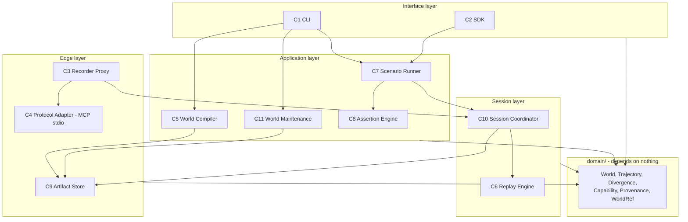

# Architecture Map

Orientation, not specification. For the full specification see [ARCH-002](ARCH-002.md). For hard rules see [invariants.md](invariants.md).

**Purpose of this document:** answer "which module owns this?", "what may I import?", and "where does state live?" without reading ARCH-002.

---

## Component diagram



---

## Module ownership

| # | Component | Responsibility | Owns state? | May depend on | Must NOT depend on |
|---|---|---|---|---|---|
| C1 | **CLI** | Argument parsing, config resolution, orchestration, rendering, exit codes | No | Everything | n/a |
| C2 | **SDK** | Scenario authoring, assertion authoring, verifier protocol, launcher hooks | No | `domain`, `execution`, `assertions` | `protocol`, `session` internals |
| C3 | **Recorder Proxy** | Transparent stdio interception; thin relay to the coordinator | No (relay only) | `protocol`, `session` (IPC client) | `replay`, `compile`, `assertions` |
| C4 | **Protocol Adapter** | Wire format to normalized `ToolInteraction` and back. **MCP stdio only in v0.1** | No | `domain` | Everything else |
| C5 | **World Compiler** | Session log to World; canonicalization; capability proposal; data inventory | No (pure) | `domain`, `artifacts` | **`replay` (INV-008 corollary)** |
| C6 | **Replay Engine** | Matcher, contract check, overlay, merge, divergence, provenance | Yes, session-scoped, held by C10 | `domain` | **`compile`**, `protocol`, `assertions` |
| C7 | **Scenario Runner** | Execution lifecycle, coordinator lifecycle, N-run aggregation, timeout, cleanup | Yes, in-flight registry | `domain`, `session`, `assertions`, `verifiers`, `artifacts` | `protocol` |
| C8 | **Assertion Engine** | `evidence_sufficient` precondition, then assertion evaluation to three-state outcomes | No | `domain` | `replay`, `session`, `protocol` |
| C9 | **Artifact Store** | Atomic read/write, content addressing, `WorldRef` resolution, cache | Filesystem layout | `domain` | Everything else |
| C10 | **Session Coordinator** | **All per-execution state**: sequence, overlay, clock, minting, divergence log, server registry | **Yes, everything session-scoped** | `domain`, `replay` | `compile`, `assertions` |
| C11 | **World Maintenance** | validate, diff, extend, merge, inspect, fingerprint, check, migrate | No (pure over inputs) | `domain`, `artifacts` | `replay`, `session` |

**Two rules worth stating twice:**

1. `replay/` must never import `compile/`. Capability inference improves over time; the engine must not change behavior when it does. See [ADR-004](adr/ADR-004-l2-core-state-model.md).
2. `domain/` imports nothing. Enforced by CI lint. See [INV-008](invariants.md#inv-008--protocol-neutrality).

---

## Where state lives

| State | Owner | Lifetime | Persisted? |
|---|---|---|---|
| Sequence counter | C10 Session Coordinator | One execution | No |
| Entity overlay | C10 (via C6) | One execution, reset between | No |
| Virtual clock | C10 | One execution | No |
| Id-minting counters | C10 | One execution | No |
| Divergence log | C10 | One execution | Yes, into the trajectory |
| Server registry | C10 | One execution | No |
| In-flight execution registry | C7 Scenario Runner | One run | No |
| Session log (RECORD) | C3 via C10 | One recording session | Yes, append-only file |
| World | C9 Artifact Store | Indefinite, immutable | Yes |
| Trajectory | C9 | Indefinite, immutable | Yes |
| Parsed world index | C9 cache | Until world hash changes | Yes, content-addressed cache |

**One Session Coordinator per execution.** N parallel executions means N coordinators. See [INV-006](invariants.md#inv-006--per-execution-state-isolation).

---

## Where persistence occurs

Only C9 Artifact Store writes durable files. Every write is atomic: temp file, fsync, rename.

Nothing else in the system writes to disk. C3 writes the session log **through** C10, which writes **through** C9.

Redaction happens **before** persistence, never after. See [T1](../security/threat-model.md).

---

## Lifecycle: RECORD

```
CLI --mode record
  -> C7 starts C10 (mode=record)
  -> agent launched, MCP config points at C3 per server
  -> per tool call:
        C3 frames JSON-RPC
        C3 -> C10.next_seq()
        C3 -> real MCP server (credentials required)
        response -> redact -> C10.log(interaction)
        C3 -> agent
  -> C10 stops, session log finalized
  -> C5 compiles: canonicalize, extract entities, propose capabilities
  -> human confirms <= 3 questions per tool
  -> World written via C9
  -> CLI: "This World contains production-shaped data. Review it before committing."
```

## Lifecycle: REPLAY

```
CLI --mode replay          (default; NO credentials, INV-011)
  -> C9 resolves WorldRef, verifies hash, loads, indexes
  -> per execution:
        C7 starts C10 (world, seed_i, mode=replay); C6 runs inside C10
        agent launched, MCP config points at C3 per server (upstream=None)
        per tool call:
              C3 -> C10.handle_call()
              C6: contract check -> match -> overlay -> merge
              returns CallOutcome (response + provenance + stale_paths | divergence)
        agent terminates | timeout | cancel
        C10.close() -> trajectory fragment + replay stats
        C8: evidence_sufficient? -> evaluate assertions -> three-state outcomes
        verifiers (concurrent, isolated), then cleanup (always)
        C9 writes trajectory atomically
  -> C7 aggregates N executions into a distribution verdict
  -> exit 0 PASS | 1 FAIL | 2 UNKNOWN | 3 usage | 4 internal
```

## Lifecycle: HYBRID (Extend)

```
CLI --mode hybrid --allow-real-side-effects   (both required)
  -> refuse if any CI marker present. NO OVERRIDE. (INV-012)
  -> banner naming every passthrough-eligible server and tool
  -> as REPLAY, except:
        uncovered call on an allowlisted (server, tool)
          -> passthrough to real server (credentials required, REAL side effects)
          -> observation recorded
        uncovered call on a non-allowlisted tool
          -> divergence, no passthrough
  -> C11.extend(world, observations) -> WorldPatch  (separate path)
  -> developer reviews the diff
  -> C11.merge(world, patch) -> new World version, parent_hash set
  -> trajectory marked mode=hybrid, rejected as a regression baseline
```

**HYBRID never mutates a World.** See [INV-010](invariants.md#inv-010--extension-produces-patches-never-silent-mutation).

---

## Trust boundaries

| ID | Boundary | Direction | Rule |
|---|---|---|---|
| B1 | Agent to Recorder | Agent trusted, arguments attacker-influenceable | Arguments may carry injected content from earlier tool output |
| B2 | Recorder to real MCP server | **Server output fully untrusted** | Never interpret tool output as instruction, path, template, or code |
| B3 | Anything to persistence | Outbound | Redact before writing. Redaction failure is fatal |
| B4 | World file to Replay Engine | **World files untrusted input** | Safe parsing only: no code eval, no arbitrary object construction, bounded depth and size |
| B5 | Local to Cloud | Outbound | Not applicable in v0.1. No upload, no telemetry |
| B6 | Agent to Model provider | Outside our control | **We never proxy model traffic.** See [ADR-002](adr/ADR-002-protocol-boundary-interception.md) |

Full threat detail: [threat-model.md](../security/threat-model.md).

---

## Extension points

Exactly two are public in v0.1.

| Extension point | Interface |
|---|---|
| `AgentLauncher` | `launch(input, mcp_config, env, timeout) -> Process`, `terminate()` |
| `SideEffectVerifier` | `name`, `async verify(context) -> VerificationResult` |

Internal, not public, changeable without notice: protocol adapters, redactors, id minters, selectors, verdict policies, `WorldRef` resolvers.

**Do not create a new public extension point without an approved requirement.**
