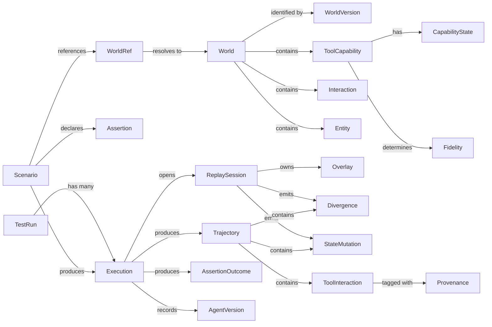

# Domain Model

Concepts engineers must reason about. **Not database design.** Persistence details live in [architecture-map.md](../architecture/architecture-map.md#where-persistence-occurs).

Terminology definitions: [glossary.md](glossary.md). This document defines *relationships and lifecycles*; the glossary defines *words*.

---

## Relationship diagram

---

## Objects

### World

**Definition.** A portable, versioned record of a subset of an external environment: which tools exist, what they do, what they returned, and what entities existed.

| Property | Value |
|---|---|
| Owns identity | Yes, via `world_id` plus `content_hash` |
| Mutable | **Immutable.** See [INV-009](../architecture/invariants.md#inv-009--worlds-are-immutable-historical-artifacts) |
| Lifetime | Indefinite. Never expires, never invalidated by service drift |
| Source of truth | The artifact file itself |

**Relationships.** Contains `ToolCapability`, `Interaction`, `Entity`. Referenced by `Scenario` through a `WorldRef`. Extended only by producing a **new** version with `parent_hash` set.

---

### WorldVersion

**Definition.** The immutable identity of a world's content: `content_hash`, `schema_version`, `created_at`, `parent_hash`.

Immutable by construction. A trajectory records the `WorldVersion` it ran against, which is what makes historical trajectories verifiable.

---

### WorldRef

**Definition.** A location-independent reference to a world: `<scheme>://<locator>[@<version>]`.

Immutable value object. **Scenarios reference a `WorldRef`, never a filesystem path.** In v0.1 only `file://` resolves; `git://` and `cloud://` parse and are rejected with a message naming the scheme (FR-150 to FR-154).

---

### ToolInteraction

**Definition.** The **normalized, protocol-neutral** representation of one tool invocation and its result. This is the sole boundary type between protocol adapters and everything above them.

| Property | Value |
|---|---|
| Owns identity | No. Identified by (trajectory, sequence) |
| Mutable | Immutable once complete |
| Lifetime | One execution, then persisted in a trajectory |
| Source of truth | The trajectory |

**Critical constraint.** Contains **no MCP-specific fields**. No JSON-RPC ids, no MCP error codes, no transport concepts. See [INV-008](../architecture/invariants.md#inv-008--protocol-neutrality).

---

### ToolCapability

**Definition.** The declared semantics of a tool: operation kind, idempotency, entity type, mutation shape, query predicate, parameter classification.

| Property | Value |
|---|---|
| Owns identity | No. Keyed by (server, tool name) within a world |
| Mutable | Immutable within a world version |
| Lifetime | Same as the world |
| Source of truth | The world artifact. **Never inferred at runtime** |

**Authority rule.** Proposed by the compiler, confirmed by a human **and** validated against observed data (ADR-006). Inference lives in `compile/` and is never imported by `replay/` (FR-165).

Carries an `EntityConstructionContract` for write tools, plus a `validation` record naming any failed check. A capability with complete human answers but failed validation stays **PROPOSED** and therefore `l1` (FR-209).

---

### CapabilityState

**Definition.** The trust level of a capability declaration: `CONFIRMED`, `PROPOSED`, `UNKNOWN`.

Determines authority, not merely completeness:

| State | Enables L2-Core | Enables safety-sensitive assertions | Serves L1 |
|---|---|---|---|
| CONFIRMED | Yes | Yes | Yes |
| PROPOSED | No | **No** | Yes |
| UNKNOWN | No | **No** | Yes |

See [INV-016](../architecture/invariants.md#inv-016--capability-state-gates-authority).

---

### Fidelity

**Definition.** The replay guarantee level assigned to a tool: `l1` or `l2_core`.

Computed at compile time from capability state and declaration completeness. **Per tool, not per world**, so one unsupported tool does not disable a world. The engine enforces it before matching (FR-188).

---

### Interaction

**Definition.** One recorded request/response pair inside a world: `seq`, `tool_ref`, `canonical_request`, `response`, `status`, `duration_ms`, `attempt`.

Immutable within a world. `canonical_request` is the match key; canonicalization rules are in [ADR-003](../architecture/adr/ADR-003-replay-matching-and-divergence.md).

---

### Entity

**Definition.** A stateful object in the simulated world: `entity_type`, `entity_id`, `body`, `deleted`, **`provenance`**.

| Property | Value |
|---|---|
| Owns identity | Yes, `(entity_type, entity_id)` |
| Mutable | **Immutable in the world; mutable in the overlay** |
| Lifetime | World entities: indefinite. Overlay entities: one execution |
| Source of truth | World for initial state, Overlay during a session |

Entities created during replay receive **deterministically minted** ids in a range disjoint from recorded ids, so minted entities are visually distinguishable in a trajectory (FR-046).

**Entity provenance** (ADR-006, FR-212). Exactly two values, no others in v0.1:

Provenance describes whether an entity's **current state** is fully grounded in recorded external state.

| Value | Meaning |
|---|---|
| `RECORDED_ENTITY` | From observed data, and unmodified in this session |
| `SYNTHESIZED_ENTITY` | Constructed through a **validated** ECC from an unrecorded request, **or** a recorded entity modified by an unrecorded replay write |

**Monotonic within a session.** Once an entity becomes `SYNTHESIZED_ENTITY` it never returns to `RECORDED_ENTITY` until `reset()`, which rebuilds the overlay from world entities. An entity's *identity* may be recorded while its *current state* is not; both facts stay visible.

There is no `UNKNOWN_ENTITY`, because [INV-017](../architecture/invariants.md#inv-017--no-structurally-unverified-overlay-state) forbids unverified state from entering the overlay at all.

---

### EntityConstructionContract

**Definition.** The minimum information required to turn a write request into faithful overlay state. Replaces `body_request_path` as the basis for entity construction (FR-200, FR-201).

| Element | Source |
|---|---|
| `entity_template` | **Observed**: recorded create responses, then recorded collection rows |
| `required_fields` | Keys present on every observed entity of the type |
| `field_bindings` | `entity_path <- request_path`, derived by value-matching; declared only as fallback |
| `generated_fields` | Server-assigned identity and timestamps (`mint` / `clock`) |
| `constant_defaults` | Keys whose observed value is identical across all observed entities |
| `cardinality` | `one`. `many` is reserved for L2-Extended and not implemented |

| Property | Value |
|---|---|
| Owns identity | No. Belongs to a `ToolCapability` |
| Mutable | Immutable within a world version |
| Lifetime | Same as the world |
| Source of truth | **Observed data**, not human declaration |

A contract is only usable once compiler validations **V1 to V6** pass (FR-206). V5, the round-trip check, is decisive: constructing from each recorded create request must reproduce the recorded entity exactly.

---

### ReplaySession

**Definition.** The lifetime of the replay engine for exactly one execution. Owns the overlay, virtual clock, id counters, sequence counter, divergence log, and match statistics.

| Property | Value |
|---|---|
| Owns identity | Yes, `session_id` |
| Mutable | Highly mutable. **All state is session-scoped** |
| Lifetime | One execution. Created at start, destroyed at end |
| Source of truth | Itself, transiently; the trajectory afterwards |

**Cardinality: one per execution**, hosted by one Session Coordinator process. Sharing across executions breaks [INV-006](../architecture/invariants.md#inv-006--per-execution-state-isolation) and [INV-007](../architecture/invariants.md#inv-007--determinism-of-the-world).

---

### StateMutation

**Definition.** A change applied to the overlay: `seq`, `entity_type`, `entity_id`, `kind` (create/update/delete), `caused_by` (ToolInteraction ref), `before_hash`, `after_hash`.

Immutable once created. Persisted in the trajectory as a list **distinct from tool calls** (FR-083), because "what changed in the world" is a different question from "what was called".

---

### Divergence

**Definition.** An observed point at which the replayed world could not faithfully answer the agent: `class`, `severity`, `seq`, `expected`, `observed`, `resolution`.

| Property | Value |
|---|---|
| Owns identity | No. Identified by (trajectory, seq, class) |
| Mutable | Immutable |
| Lifetime | Created during replay, persisted in the trajectory |

**A first-class domain concept, not an error path.** Classes and severities: [ADR-003](../architecture/adr/ADR-003-replay-matching-and-divergence.md). See [INV-005](../architecture/invariants.md#inv-005--divergence-is-first-class-and-always-visible).

---

### Provenance

**Definition.** The origin of a replayed response: `RECORDED`, `OVERLAY`, `SYNTHESIZED`, plus `stale_paths` for path-level staleness.

Attached to every `ToolInteraction`. Degrades **response-content** assertions to UNKNOWN; **call-shape assertions are exempt** (FR-172).

---

### Scenario

**Definition.** A named test unit binding an input, a `WorldRef`, assertions, optional verifiers, run count, timeout, strictness, and tags.

Authored by the user, versioned in their repository. Produces `Execution` objects.

---

### Execution

**Definition.** One run of one scenario: `execution_id`, `scenario_id`, `world_version`, `seed`, `index`, `verdict`, timing.

| Property | Value |
|---|---|
| Owns identity | Yes |
| Mutable | Mutable while running, immutable once complete |
| Lifetime | Seconds to minutes |

Has one `Trajectory` and many `AssertionOutcome`. **Isolated from every other execution.**

---

### Trajectory

**Definition.** The complete evidence of one execution: ordered `ToolInteraction`s, `StateMutation`s, `Divergence`s, usage, agent events, and the mode it ran in.

| Property | Value |
|---|---|
| Owns identity | Yes, `trajectory_id` plus `content_hash` |
| Mutable | **Immutable once the execution completes** |
| Lifetime | Indefinite |
| Source of truth | Itself. **The primary evidence object of the system** |

Records the resolved `WorldRef` and the world `content_hash` (FR-154), plus `mode`. HYBRID trajectories are rejected as regression baselines (FR-145).

---

### Assertion

**Definition.** A declarative behavioral expectation: `kind`, `parameters`, `id`.

**The nine primitives. Canonical list.** Everything else is composition. Adding a tenth requires an approved requirement.

| Primitive | Signature | Class | Safety-sensitive |
|---|---|---|---|
| `called` | (tool, server?, times?, args?, status?, predicate?) | Call-shape | No |
| `sequence` | (steps[], allow_extra_reads?, status?) | Call-shape | No |
| `ordered` | (before, after, status?) | Call-shape | No |
| `operation_profile` | (allow: {read} or {read,write}) | Call-shape | **Yes** |
| `unique_writes` | (identity?) | Call-shape | **Yes** |
| `no_failures` | (tool?, server?) | Call-shape | No |
| `attempts_within` | (max, tool?, server?) | Call-shape | No |
| `workflow_size` | (max_steps) | Call-shape | No |
| `side_effect` | (verifier) | Response-content | No |

Notes that follow from the table:

- `called` with `times=0` subsumes "not called". `sequence` subsumes ordering. `attempts_within` subsumes retries and attempts. This is why there are nine rather than sixteen.
- **Call-shape** primitives are exempt from provenance degradation (FR-172). **Response-content** primitives degrade to Verdict UNKNOWN on SYNTHESIZED provenance or a touched STALE path (FR-171).
- **Safety-sensitive** primitives read `operation` and therefore require a CONFIRMED capability; otherwise they yield Verdict UNKNOWN ([INV-016](../architecture/invariants.md#inv-016--capability-state-gates-authority)).
- `evidence_sufficient` is **not** an assertion. It is an engine-level precondition applied before any of the nine run. See [ADR-005](../architecture/adr/ADR-005-evidence-semantics.md).

---

### AssertionOutcome

**Definition.** The result of evaluating one assertion: `assertion_id`, `state`, `expected`, `observed`, `message`, `evidence_refs`.

**`state` is three-valued: PASS, FAIL, UNKNOWN.** Never boolean. See [ADR-005](../architecture/adr/ADR-005-evidence-semantics.md).

`evidence_refs` is what allows the engine to compute which assertions a divergence degrades, rather than leaving that to assertion authors.

---

### TestRun

**Definition.** One invocation of the runner over a scenario set: `run_id`, timing, `agent_version`, `environment`, scenario results.

Has many `Execution`. Aggregates into the process exit code.

---

### AgentVersion

**Definition.** The identity of the system under test: `agent_id`, `vcs_ref`, `prompt_hash`, `model_id`, `framework`.

Captured at execution start, referenced by `Execution`. Without it, comparing trajectories across time is meaningless.

---

## Deliberately not domain objects

| Concept | Why not |
|---|---|
| **Overlay** | Internal state of `ReplaySession`, not something a user reasons about |
| **Report** | A rendering of `TestRun`, not an entity |
| **Session Coordinator** | A process and a component, not a domain concept |
| **World patch** | A `WorldDiff` produced by World Maintenance; modelled as a transformation, not an entity |

---

## Mutability summary

| Immutable | Mutable |
|---|---|
| World, WorldVersion, WorldRef, Interaction, ToolCapability, ToolInteraction, StateMutation, Divergence, Trajectory, AssertionOutcome | ReplaySession, Overlay entities, Execution (while running), TestRun (while running) |

**Everything persisted is immutable.** Everything mutable is session-scoped and discarded. This is not incidental; it is what makes [INV-007](../architecture/invariants.md#inv-007--determinism-of-the-world) and [INV-009](../architecture/invariants.md#inv-009--worlds-are-immutable-historical-artifacts) enforceable.
